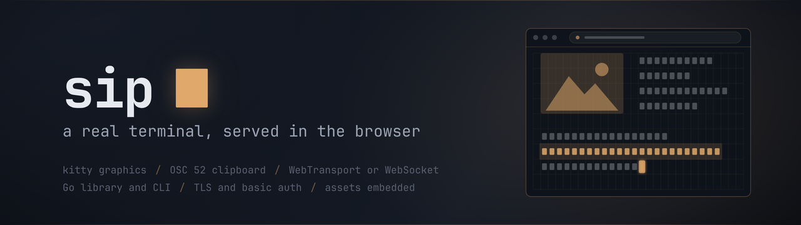
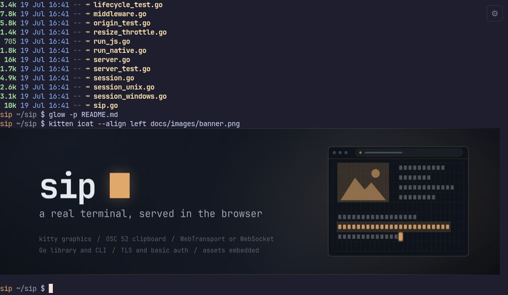
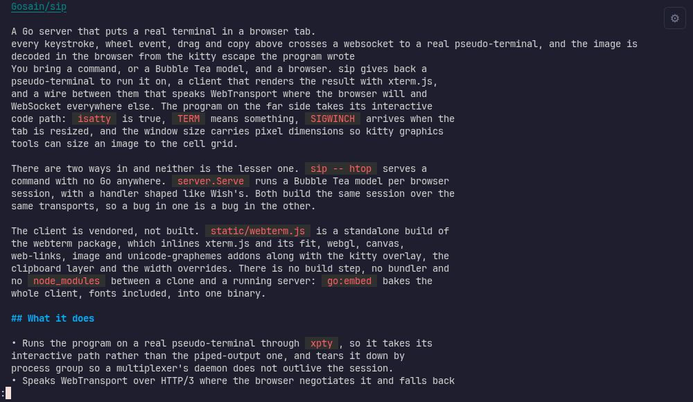
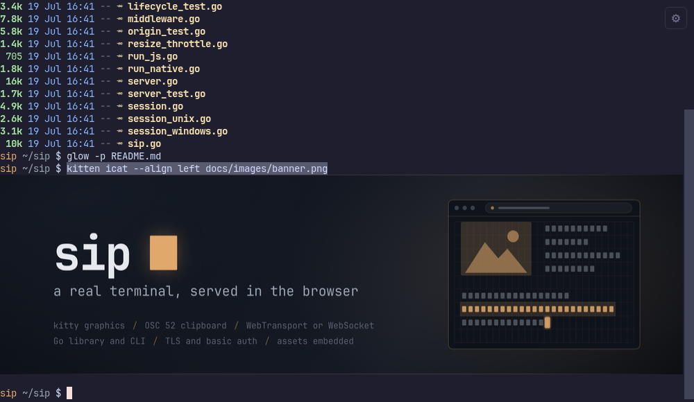
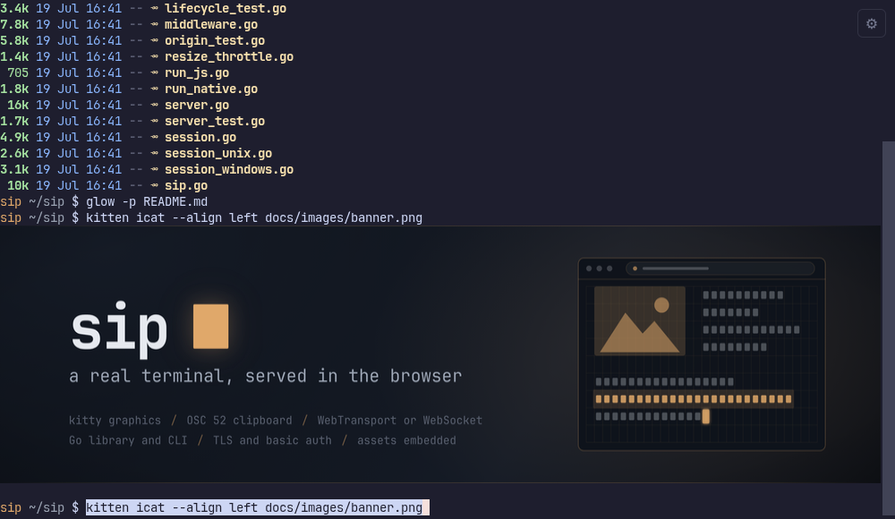
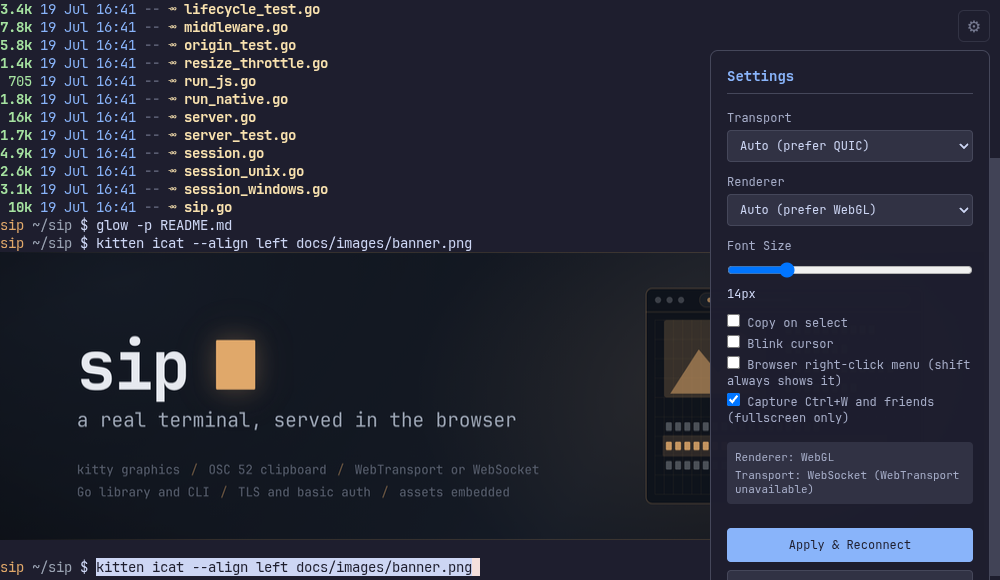

<p align="center">
  
</p>

# sip

[](https://pkg.go.dev/github.com/Gaurav-Gosain/sip)

A Go server that puts a real terminal in a browser tab.

<p align="center">
  
</p>
<p align="center">
  <sub>every keystroke, wheel event, drag and copy above crosses a websocket to a real pseudo-terminal, and the image is decoded in the browser from the kitty escape the program wrote</sub>
</p>

You bring a command, or a Bubble Tea model, and a browser. sip gives back a
pseudo-terminal to run it on, a client that renders the result with xterm.js,
and a wire between them that speaks WebTransport where the browser will and
WebSocket everywhere else. The program on the far side takes its interactive
code path: `isatty` is true, `TERM` means something, `SIGWINCH` arrives when the
tab is resized, and the window size carries pixel dimensions so kitty graphics
tools can size an image to the cell grid.

There are two ways in and neither is the lesser one. `sip -- htop` serves a
command with no Go anywhere. `server.Serve` runs a Bubble Tea model per browser
session, with a handler shaped like Wish's. Both build the same session over the
same transports, so a bug in one is a bug in the other.

The client is vendored, not built. `static/webterm.js` is a standalone build of
the webterm package, which inlines xterm.js and its fit, webgl, canvas,
web-links, image and unicode-graphemes addons along with the kitty overlay, the
clipboard layer and the width overrides. There is no build step, no bundler and
no `node_modules` between a clone and a running server: `go:embed` bakes the
whole client, fonts included, into one binary.

## What it does

- Runs the program on a real pseudo-terminal through `xpty`, so it takes its
  interactive path rather than the piped-output one, and tears it down by
  process group so a multiplexer's daemon does not outlive the session.
- Speaks WebTransport over HTTP/3 where the browser negotiates it and falls back
  to WebSocket otherwise, with the same type-prefixed binary framing behind both
  and a `/cert-hash` exchange for the self-signed loopback case.
- Draws kitty graphics through an overlay that anchors each placement to the
  buffer row that introduced it, so images scroll with their text instead of
  hanging over it, and repositions every placement on scroll and resize.
- Decodes PNG placements in the browser with `createImageBitmap`. The
  server-side transcoder that re-emits them as raw RGBA is there for clients
  without a decoder and is off by default, because forwarding the compressed
  payload is both smaller and faster.
- Carries pixel dimensions on resize and forwards them to `TIOCSWINSZ`, which is
  what `kitten icat` and ntcharts read to size an image to the grid.
- Copies a selection to the system clipboard on Ctrl+C, and forwards OSC 52
  writes from programs that set the clipboard themselves. It never answers an
  OSC 52 read: a remote program cannot pull your clipboard back through the
  terminal.
- Clusters graphemes to UAX 29 rather than billing per scalar, so a ZWJ family
  emoji takes the columns it draws in instead of eight.
- Puts a key bar over the software keyboard on a phone, carrying the keys a
  phone keyboard does not have: Escape, Tab, the arrows, and Ctrl and Alt as
  sticky modifiers, because a touch screen cannot hold one key while pressing
  another. It measures the keyboard and gives the terminal what is left.
- Refuses to bind a non-loopback address without TLS, and refuses basic auth
  without it, unless told otherwise by an explicit flag that logs what it is
  giving up. Loopback gets a self-signed certificate generated on the spot.
- Composes at three layers, after Wish: `ConnectMiddleware` wraps the handshake,
  `SessionMiddleware` wraps the byte streams, and `Middleware` wraps the
  per-session handler. `LiftHTTPMiddleware` turns any
  `func(http.Handler) http.Handler` into the first of those, so chi, gorilla and
  otelhttp are all reusable at the door.
- Ships as one binary. The client, the stylesheets and JetBrains Mono Nerd Font
  are embedded, tagged with a content ETag so a redeployed client actually takes
  effect.

## What it looks like

Every image below is a frame of the real client in a real browser, driven
against a real server by [scripts/demo/record-hero.mjs](scripts/demo/record-hero.mjs),
which is also what regenerates the recording at the top of this page. The
programs are the ones on this machine and the files are this repository's own.

<table>
  <tr>
    <td></td>
  </tr>
  <tr>
    <td align="center"><sub>a kitty graphics placement, sent as PNG over the socket and decoded in the browser</sub></td>
  </tr>
  <tr>
    <td></td>
  </tr>
  <tr>
    <td align="center"><sub>a Bubble Tea program on the alternate screen, scrolled with a real mouse wheel</sub></td>
  </tr>
  <tr>
    <td></td>
  </tr>
  <tr>
    <td align="center"><sub>a drag selection over a command line in the scrollback, on its way to the clipboard</sub></td>
  </tr>
  <tr>
    <td></td>
  </tr>
  <tr>
    <td align="center"><sub>the same text pasted back at the prompt, out of the system clipboard Ctrl+C wrote it to</sub></td>
  </tr>
  <tr>
    <td></td>
  </tr>
  <tr>
    <td align="center"><sub>the client's own settings, reporting the renderer and the transport it actually got</sub></td>
  </tr>
</table>

## Install

```bash
go get github.com/Gaurav-Gosain/sip          # library
go install github.com/Gaurav-Gosain/sip/cmd/sip@latest   # command line
```

## Command line

```bash
sip -- htop                                   # serve a command
sip -p 8080 -- lazygit                        # on another port
sip --host 0.0.0.0 --cert s.crt --key s.key -- bash       # public, with TLS
sip --basic-user admin --basic-pass-file /run/secrets/sip --cert s.crt --key s.key -- bash
sip --font /path/to/CommitMono.ttf --font-family "Commit Mono" -- nvim
```

Then open <http://localhost:7681>. The command to run goes after `--`, so its
own flags are never read as sip's.

| flag | meaning |
| --- | --- |
| `-H, --host`, `-p, --port` | bind address and HTTP port; WebTransport uses port+1 |
| `--cert`, `--key` | TLS certificate and key |
| `--allow-insecure-no-tls` | permit a non-loopback bind, or basic auth, without TLS |
| `--origin` | browser origin allowlist, a `path.Match` glob, repeatable |
| `--basic-user`, `--basic-pass-file` | HTTP basic auth; `$SIP_PASSWORD` is also read |
| `--max-conns`, `--idle-timeout` | concurrent session limit and idle cutoff |
| `--renderer` | `webgl`, `canvas` or `dom`; empty picks the best available |
| `--font`, `--font-family` | serve a font from disk instead of the embedded one |
| `-d, --dir` | working directory for the wrapped command |

`sip completion` writes a bash, zsh, fish or powershell script. Commands, help
and completion are built on `spf13/cobra` and rendered by `charmbracelet/fang`.

## Library

```go
server := sip.NewServer(sip.DefaultConfig())

err := server.Serve(ctx, func(sess sip.Session) (tea.Model, []tea.ProgramOption) {
	pty := sess.Pty()
	return model{width: pty.Width, height: pty.Height}, nil
})
```

`Handler` returns a model and its options per session. `ServeWithProgram` takes a
`ProgramHandler` and hands back a `*tea.Program` instead, for when the program
needs constructing directly:

```go
server.ServeWithProgram(ctx, func(sess sip.Session) *tea.Program {
	return tea.NewProgram(myModel{}, sip.MakeOptions(sess)...)
})
```

A `Session` is the terminal:

```go
type Session interface {
	Pty() Pty                            // terminal dimensions
	Context() context.Context            // cancelled when the browser goes away
	Read(p []byte) (n int, err error)
	Write(p []byte) (n int, err error)
	WindowChanges() <-chan WindowSize    // resize events
}
```

`Config` covers the rest: `Host`, `Port`, `ReadOnly`, `MaxConnections`,
`IdleTimeout`, `AllowOrigins` and `OriginPatterns`, `TLSCert` and `TLSKey`,
`BasicUsername` and `BasicPassword`, `MaxPasteBytes`, `ResizeThrottle`,
`MaxWindowDims`, `FontPath` and `FontFamily`, and the three middleware slices.
Every field has a working default; `sip.DefaultConfig()` is a complete
configuration.

Three middleware subpackages ship with it: `middleware/osc52gate` to allow, deny
or audit outbound OSC 52 clipboard writes, `middleware/recover` to catch a panic
while a handler builds a model, and `middleware/logging` for slog session start
and end lines.

A Bubble Tea program can also be compiled to wasm and run with no server at all:
`go run ./cmd/sip-wasm-build -o web/app.wasm ./cmd/myapp` builds it, and the
client connects to it through the same adapter it uses for a socket.

## Phones

A phone keyboard has no Escape, no Tab, no Ctrl and no arrows, which is most of
what a terminal is driven with, and when it opens it covers the bottom half of
the terminal it was opened for. On a touch device sip puts a scrolling key bar
above the keyboard with those keys on it, measures how much of the window the
keyboard is actually covering, and reserves it so the grid is refitted to what
is left rather than being hidden behind it. Ctrl and Alt are sticky: one tap
arms the modifier for the next keystroke, a second locks it until tapped off.

The default key set assumes nothing about what is running, because sip serves
arbitrary programs. A library caller that knows better can replace it:

```go
srv, _ := sip.New(sip.Config{
    MobileKeys: []sip.MobileKey{
        {Label: "esc", Title: "Escape", Key: "Escape"},
        {Label: "ctrl", Title: "Ctrl", Mod: "ctrl"},
        {Label: "^C", Title: "Interrupt", Key: "c", Ctrl: true},
        {Label: "/", Title: "Search", Key: "/", Narrow: true},
    },
})
```

`Key` is a `KeyboardEvent` key name or a literal character, `Mod` makes the
button a sticky modifier instead, and `DisableMobileKeyBar` leaves the strip out
for a program that draws touch controls of its own while keeping the
keyboard-aware layout.

The floating settings gear is draggable on a desktop and remembers where it was
left, because it floats over whatever the program is drawing and there is no
corner that is free of every program. On a phone it is not a floating control at
all: it moves into the key bar.

## Clipboard

Two independent paths, and which one you need depends on the program.

Selection, which works everywhere and needs no configuration: drag to select and
press Ctrl+C. Double-click takes a word, triple-click a line. When a program
holds the mouse, as tmux, vim and htop do with mouse mode on, hold Shift while
dragging to bypass mouse reporting and select the screen text instead. "Copy on
select" in the settings panel copies on release. Ctrl+Shift+C is not the path to
rely on: both Chromium and Firefox reserve it for devtools and it never reaches
the page.

OSC 52, for programs that set the clipboard themselves: sip forwards the escape
to the browser, which writes it to the system clipboard. tmux does not emit OSC
52 under its default `set-clipboard external`, so add `set -g set-clipboard on`
to your tmux.conf, at every level if you nest it. On a secure origin, meaning
https or http on localhost, the write is immediate; on a plain-http LAN address
the browser blocks the async clipboard API and sip falls back to a legacy copy
that runs on your next click or keypress. Serving over https is how to get
gesture-free clipboard writes.

## Related

- [Bubble Tea](https://github.com/charmbracelet/bubbletea), the TUI framework the library mode serves
- [Wish](https://github.com/charmbracelet/wish), SSH for Bubble Tea apps, and the model for sip's handler and middleware API
- [webterm](https://github.com/Gaurav-Gosain/webterm), the embeddable browser terminal sip vendors as its client
- [TUIOS](https://github.com/Gaurav-Gosain/tuios), the terminal window manager sip was extracted from
- [xterm.js](https://xtermjs.org/), which parses the VT stream and owns input, selection and scrollback
- [ttyd](https://github.com/tsl0922/ttyd), the same idea in C

## License

MIT. See [LICENSE](LICENSE).
